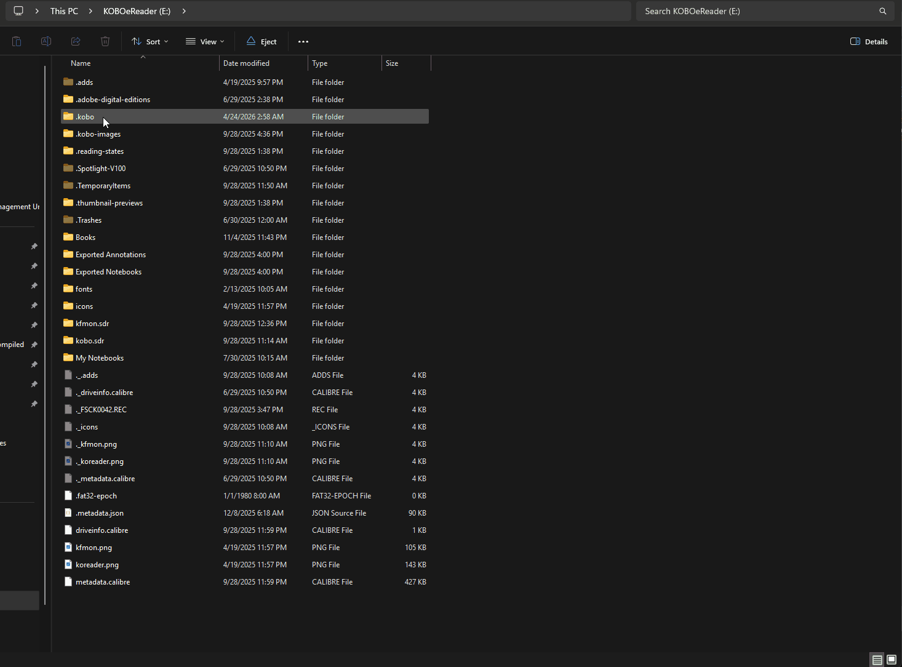
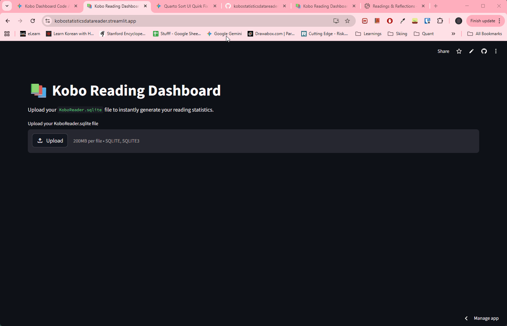

# Kobo Reading Dashboard

## Extracting Data from Kobo E-readers

Modern e-readers store a massive amount of behavioral telemetry - every page turn, reading session, highlight, and dictionary lookup is logged. However, Kobo devices lock this data inside a messy, internal SQLite database (KoboReader.sqlite) utilizing binary blobs and hex-encoded strings.

The objective of this project was to build a data pipeline that parses this raw SQLite file, decodes the proprietary binary formats, and serves the cleansed data through an interactive Streamlit dashboard.

## Extra in this Github
In creating this application, i also created tools that would run offline in the jupyter notebooks that would be able to connect to the .sqlite and pull that data automatically into my obsidian notes. If this is something that you use please feel free to use these files as well. 

Beyond that, i wanted a way to push these Obsidian files quickly into my quarto website files as well, so i also created an automation that converted data from my Obsidian markdown files, where i was storing my book reviews and all, to be converted to the quarto markdown format automatically, please feel free to edit it for your own use as well. 

---

## Using the Dashboard (Step-by-Step)
The application is designed to be plug-and-play for any Kobo user.

### Step 1: Data Ingestion
You need to connect your Kobo to your computer via a data cable and there should be a pop-up that asks if you want to connect your Kobo to your computer, message on your Kobo. Click yes and you will be able to access the file system for your Kobo. 

Once there, navigate to your .kobo file, you might need to google how to view hidden files. In windows file explorer you can do this under Hidden > Show > Hidden Items. Once you know the location of your KoboReader.sqlite, you can proceed to the next step by launching the dashboard extractor app on streamlit.

### Step 2: The Reading Overview

Once loaded, the Overview tab provides a macro view of reading habits.

Users can use cascading dropdowns to filter by Year and Month.

The dynamic ledger aggregates total reading time and lists exactly which books were interacted with during that specific period.

### Visualizing Habits & Streaks
To gamify the reading experience, the app translates individual page-turn timestamps into an interactive GitHub-style calendar heatmap and calculates longest and current reading streaks. A secondary tab utilizes plotly to break down reading sessions by time of day (Morning, Afternoon, Evening, Night).

### Knowledge Extraction (Vocab & Highlights)
Kobo's built-in dictionary tool is fantastic for learning, but terrible for exporting. The dashboard isolates the WordList and Bookmark tables, allowing users to view, sort, and search their saved highlights and vocabulary words natively in the browser.

### Step 3: Raw Data Export
For users building a "Second Brain" (like Obsidian or Notion), the app includes a raw data exporter. By clicking a button, the app generates a multi-sheet Excel file containing all 30+ parsed SQLite tables, plus a specialized sheet containing every single raw, un-aggregated page turn timestamp.

This is located in the last tab and take note that it might take some time for the excel to be produced. The final excel file is also really messy on the first tab, might need to clean it up abit with excel or with python if you're familiar. 

## Architecture & Engineering Challenges
Extracting data from an undocumented, proprietary database requires significant data wrangling. Here are the core engineering hurdles overcome in this project:

1. Binary Blob Parsing & "Ghost Time" Recovery
Kobo stores individual page-turn events as compressed binary blobs rather than standard relational rows.

I built a custom KoboBinaryReader class to unpack these blobs using Python's struct module, clustering timestamps into distinct reading "sessions".

The "Ghost Time" Problem: Side-loaded books often fail to generate page-turn blobs, resulting in hours of "lost" reading time in the analytics. To solve this, the pipeline intelligently cross-references the master TimeSpentReading metadata. If a book has recorded time but no binary events, the app generates a Synthetic Session anchored to the DateLastRead timestamp, ensuring 100% time accuracy.

2. Resilient Relational Mapping
Kobo's internal schema is highly inconsistent across firmware versions.

Hex-Encoded Text: The WordList table randomly encodes plain text and dates into hex strings. I implemented a robust decode_kobo_text helper to dynamically catch and decode these fields on the fly.

Fuzzy URI Matching: Linking a vocabulary word back to its parent book is notoriously difficult because Kobo relies on heavily encoded file paths (e.g., file:///mnt/onboard/Books/Title%20Name...). The pipeline utilizes urllib.parse.unquote to normalize these URIs and builds a Master Title Map. If the exact ID match fails due to moved folders, a fallback algorithm successfully maps the filename substring to the clean book title.

3. Title Normalization
E-readers heavily rely on "Sort Titles" (e.g., Vegetarian, The instead of The Vegetarian). The data pipeline automatically detects common suffixes and re-arranges the strings to ensure the UI remains clean and human-readable.

👉 **[Read the full guide at jordanchongja.github.io](https://jordanchongja.github.io/projects/kobostatisticsdatareader)**